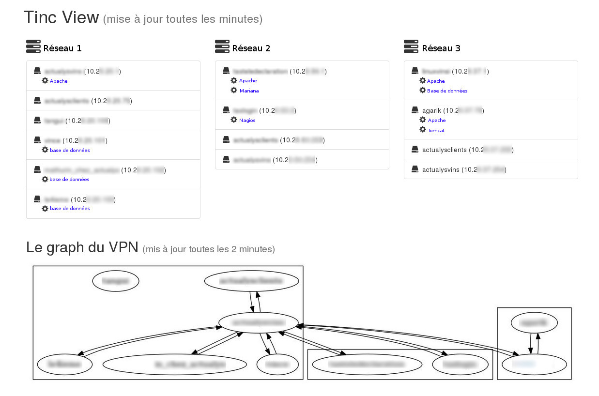

#Tinc View

Basic tools to generate an HTML visualisation of Tinc Networks.

##Example

Here is an example of a Tinc View page with 3 networks :

##Configuration

It exploits the tinc host configuration files and the native *DumpGraph* option (by default the graph file should be *network.graph*).

To add services and VPN Ip address of the host use extra configuration directives *NodeIP* and *HostedServices* in the *hosts* files. Here is a host example :

    #NodeIP=10.1.1.100
    #HostedServices=[http://10.1.1.100:8080/root/app|Tomcat]
    -----BEGIN RSA PUBLIC KEY-----
    XXXXXXXXXXXXXXXXXXXXXXXXXXXXXXXXXXXXXXXXXXXXXXXXXXXXXXXXXXXXXXXX
    XXXXXXXXXXXXXXXXXXXXXXXXXXXXXXXXXXXXXXXXXXXXXXXXXXXXXXXXXXXXXXXX
    XXXXXXXXXXXXXXXXXXXXXXXXXXXXXXXXXXXXXXXXXXXXXXXXXXXXXXXXXXXXXXXX
    XXXXXXXXXXXXXXXXXXXXXXXXXXXXXXXXXXXXXXXXXXXXXXXXXXXXXXXXXXXXXXXX
    XXXXXXXXXXXXXXXXXXXXXXXXXXXXXXXXXXXXXXXXXXXXXXXXXXXXXXXXXXXXXXXX
    XXXXXXXXXXXXXXXXXXXXXXXXXXXXXXXXXXXXXXXXXXXXXXXXXXXXXXXXXXXXXXXX
    -----END RSA PUBLIC KEY-----

